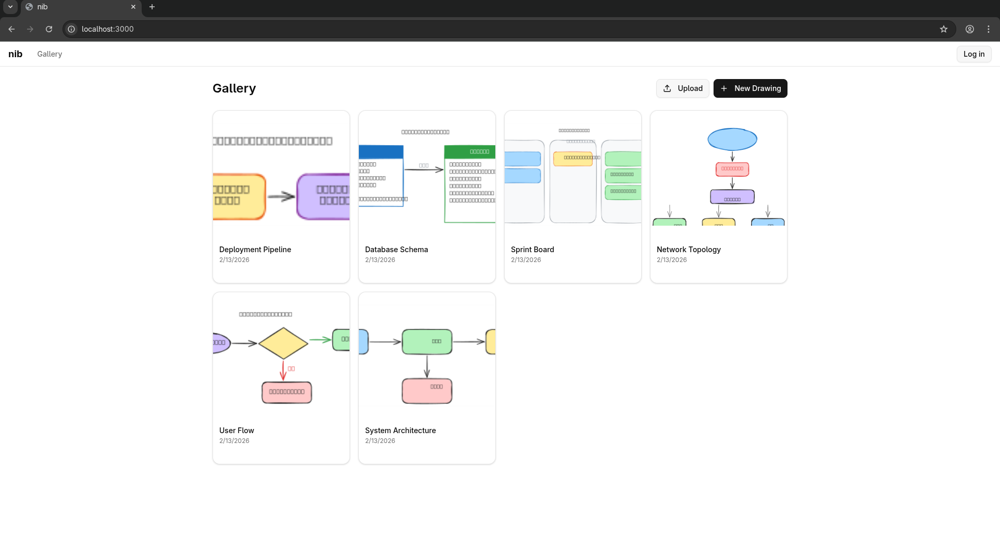
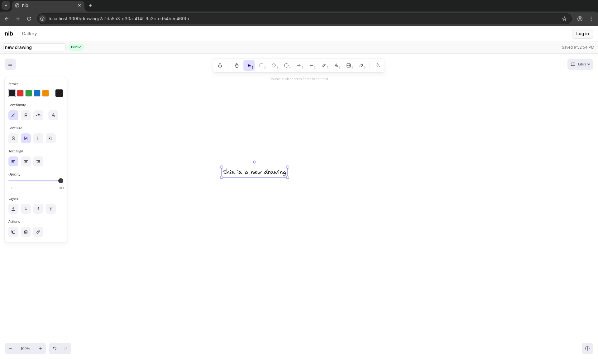
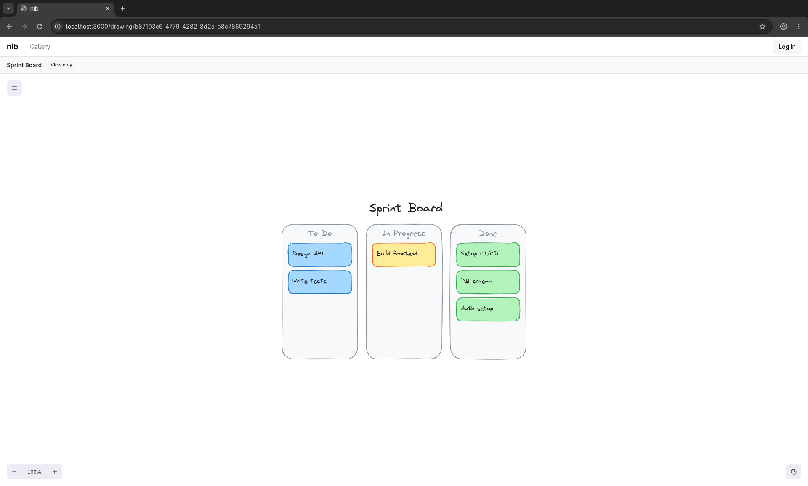
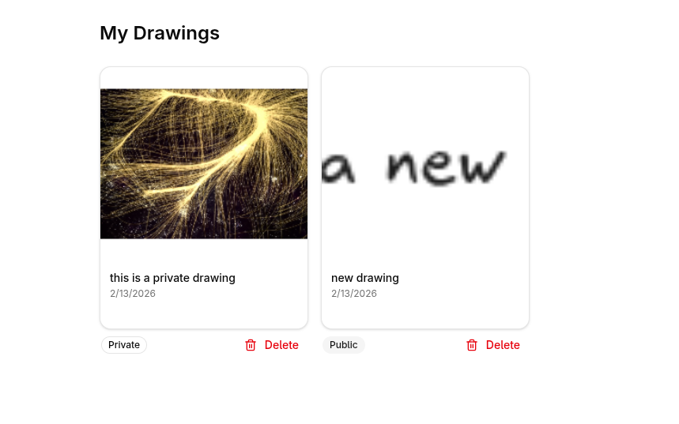
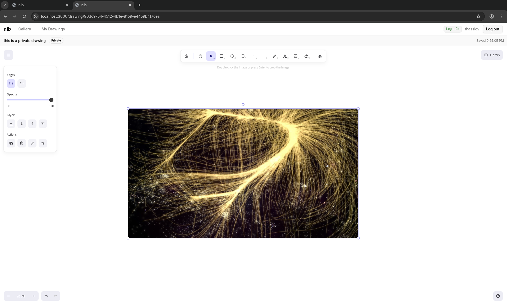
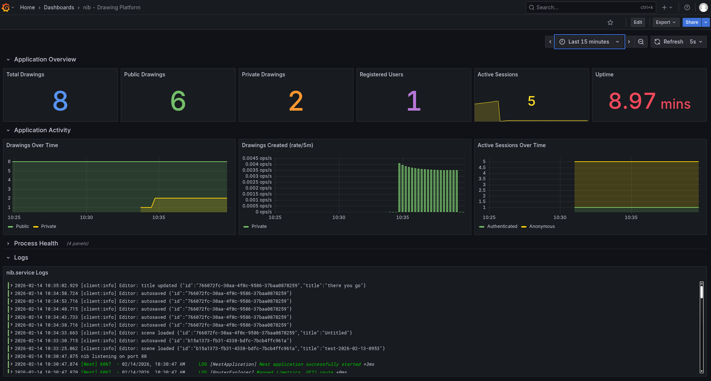

# nib

A self-hosted drawing platform powered by [Excalidraw](https://excalidraw.com/). Create, save, and share drawings with authentication, persistent storage, and galleries.

## Screenshots

**Public gallery** — browse drawings without an account, with server-generated thumbnails



**Editor** — full Excalidraw editor with autosave, visibility badges, and drawing tools



**Read-only view** — non-owners see a "View only" badge and can clone but not edit



**My Drawings** — authenticated users see their own drawings with visibility and delete controls



**Private drawings** — authenticated users can create private drawings with image support



**Grafana dashboard** — application metrics, activity timeseries, process health, and logs



## Features

- **Excalidraw editor** with incremental autosave, manual save, cloning, and file upload
- **Public gallery** for sharing drawings with anyone
- **Personal drawings** page with visibility toggles and delete
- **Thumbnail previews** generated on save
- **OIDC authentication** via any OpenID Connect provider (tested with Authelia)
- **Anonymous access** — anyone can create and edit drawings without logging in, with session-based ownership (30-day TTL). Logging in adopts anonymous drawings into the user's account
- **User roles** — admin and user roles, controlled via `ADMIN_SUBS` env var
- **File upload API** — upload `.excalidraw` files via curl or scripts, with or without authentication
- **Scene validation** — structural validation of Excalidraw scene data on the server
- **Prometheus metrics** — `/metrics` endpoint with drawing, user, and process gauges for monitoring
- **HTTP compression** — gzip/deflate for all responses
- **Docker support** — single `docker compose up` to run everything

## Stack

TypeScript, React 18, Vite 5, Tailwind CSS v4, shadcn/ui, NestJS 11, Express 5, Sequelize, PostgreSQL.

## Quick start (Docker)

```bash
git clone https://github.com/thassiov/nib.git
cd nib
```

Create a `.env` file:

```bash
SESSION_SECRET=<generate-with-openssl-rand-hex-32>
DB_PASS=<postgres-password>
OIDC_ISSUER=https://your-oidc-provider.example.com
OIDC_CLIENT_ID=nib
OIDC_CLIENT_SECRET=<your-oidc-client-secret>
OIDC_REDIRECT_URI=http://localhost:3000/auth/callback
OIDC_POST_LOGOUT_URI=http://localhost:3000
```

Run:

```bash
docker compose up -d
```

The app will be available at `http://localhost:3000`. The included PostgreSQL container handles the database automatically.

> Without an OIDC provider, the app still works — you can use the public gallery and create anonymous drawings. Authentication is only needed for private drawings and the "My Drawings" page.

## Quick start (bare metal)

### Prerequisites

- Node.js 22+
- PostgreSQL

### Install and run

```bash
git clone https://github.com/thassiov/nib.git
cd nib
npm install
```

Create the database and run migrations:

```bash
createdb nib
npx tsx server/migrate.ts
```

Set environment variables (see [Environment variables](#environment-variables)) and start:

```bash
# Development (server + client with hot reload)
npm run dev

# Production
npm run build
npm start
```

In development, Vite serves the client on port 5173 and proxies `/api` and `/auth` to the NestJS server on port 3000. In production, NestJS serves everything on a single port.

## Environment variables

| Variable | Default | Description |
|---|---|---|
| `PORT` | `3000` | Server listen port |
| `SESSION_SECRET` | - | Express session secret (required) |
| `NODE_ENV` | - | Set to `production` for secure cookies and static serving |
| `DB_HOST` | `localhost` | PostgreSQL host |
| `DB_PORT` | `5432` | PostgreSQL port |
| `DB_NAME` | `nib` | Database name |
| `DB_USER` | `nib` | Database user |
| `DB_PASS` | - | Database password (required) |
| `OIDC_ISSUER` | - | OIDC provider URL |
| `OIDC_CLIENT_ID` | `nib` | OIDC client ID |
| `OIDC_CLIENT_SECRET` | - | OIDC client secret |
| `OIDC_REDIRECT_URI` | `http://localhost:3000/auth/callback` | OIDC callback URL |
| `OIDC_POST_LOGOUT_URI` | `http://localhost:3000` | Post-logout redirect URL |
| `COOKIE_SECURE` | `false` | Set to `true` behind TLS-terminating proxy |
| `ADMIN_SUBS` | - | Comma-separated OIDC subject IDs for admin users |

## Architecture

```
client/                  React SPA (Vite + Tailwind v4 + shadcn/ui)
  components/            NavBar, SceneCard, NewDrawingButton, UploadDrawingButton
  components/ui/         shadcn/ui primitives (Button, Card, Badge, Tooltip)
  contexts/              Auth state (useAuth hook)
  pages/                 Gallery, MyDrawings, Editor

server/                  NestJS API
  auth/                  OIDC integration, guards (AuthGuard, OptionalAuthGuard, AdminGuard)
  scenes/                Scene CRUD (controller, service, repository, validator)
  users/                 User operations (service, repository)
  database/              Sequelize models (User, Scene)
  metrics/               Prometheus metrics (prom-client)
  services/              Excalidraw scene structural validator, thumbnail generator
```

See [`docs/`](docs/) for detailed documentation on [architecture](docs/architecture.md), [authentication](docs/authentication.md), [deployment](docs/deployment.md), and [development](docs/development.md).

## How it works

### Anonymous users

Anyone can visit the gallery and create drawings without an account. Anonymous drawings are tied to the browser session (30-day TTL) — the creator can edit them, but others can only view and clone. If the session expires, the drawing becomes permanently read-only.

When an anonymous user logs in, all their session-owned drawings are automatically adopted into their account.

### Authentication

nib uses OIDC with PKCE. Users authenticate through your identity provider (Authelia, Keycloak, Auth0, etc.) and the server manages sessions via HTTP-only cookies stored in PostgreSQL.

### Drawing ownership

| Scenario | Can edit | Can delete | Visible in gallery |
|---|---|---|---|
| Authenticated owner | Yes | Yes | If public |
| Authenticated non-owner | No | No | If public |
| Anonymous creator (same session) | Yes | No | If public |
| Anonymous viewer | No | No | If public |

## API

### Scenes

```
GET    /api/scenes              Public gallery (paginated)
GET    /api/scenes/my           User's drawings (requires auth)
GET    /api/scenes/:id          Get a drawing
POST   /api/scenes              Create drawing (JSON body)
POST   /api/scenes/upload       Upload .excalidraw file (multipart, auth optional)
POST   /api/scenes/validate     Validate scene data without saving
PUT    /api/scenes/:id          Full update (requires ownership)
PATCH  /api/scenes/:id          Incremental update — changed elements only (requires ownership)
DELETE /api/scenes/:id          Delete drawing (requires ownership)
```

### Auth

```
GET    /auth/login              Redirect to OIDC provider
GET    /auth/callback           OIDC callback
GET    /auth/logout             Destroy session, redirect to OIDC end-session
GET    /auth/me                 Current user info (or 401)
```

### Observability

```
GET    /metrics                 Prometheus metrics (prom-client format)
GET    /api/health              Database and OIDC connectivity check
```

The `/metrics` endpoint exposes:
- `nib_drawings_total{visibility}` — gauge of total drawings by visibility (public/private)
- `nib_users_total` — gauge of registered users
- `nib_sessions_active{type}` — gauge of active sessions (authenticated/anonymous)
- `nib_drawings_created_total{visibility}` — counter of drawings created
- `nib_drawings_deleted_total` — counter of drawings deleted
- Default Node.js process metrics (CPU, memory, event loop, GC)

### Upload via curl

```bash
# Anonymous upload (public by default)
curl -X POST http://localhost:3000/api/scenes/upload \
  -F "file=@my-drawing.excalidraw"

# With title
curl -X POST http://localhost:3000/api/scenes/upload \
  -F "file=@sketch.excalidraw" \
  -F "title=Architecture Diagram"
```

## Testing

```bash
npm test            # Run all 148 tests
npm run test:watch  # Watch mode
```

Tests use Vitest with SQLite in-memory for server tests and jsdom for client tests.

| Suite | Tests | Coverage |
|---|---|---|
| Scene CRUD + upload + patch + adoption | 71 | Full API integration |
| Excalidraw scene validation | 26 | Structural validator |
| Database models + associations | 13 | Models, cascades, anonymous scenes |
| API client (React) | 12 | Scene API functions |
| Prometheus metrics | 7 | Gauges, counters, process metrics |
| Auth context (React) | 6 | Client auth state |
| NavBar (React) | 4 | Navigation rendering |
| Protected routes (React) | 3 | Route guarding |
| Auth guard | 3 | Request guard |
| Auth controller | 2 | Login adoption |
| App controller | 1 | Health endpoint |

## Scripts

| Script | Description |
|---|---|
| `npm run dev` | Start server + client with hot reload |
| `npm run dev:server` | NestJS with `tsx watch` |
| `npm run dev:client` | Vite dev server |
| `npm run build` | Build client (Vite) + server (tsc) |
| `npm start` | Run production server |
| `npm test` | Run all tests |
| `npm run test:watch` | Tests in watch mode |
| `npm run migrate` | Sync database schema |

## License

MIT
